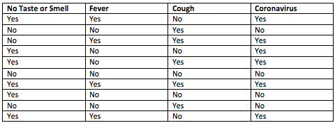

# AVALIAÇÃO 1 
> Orientações para execução da prova.

Esse documento exibe as descrições das questões e a relação dos datasets que devem ser utiizados 
pelos alunos e alunas.

O modelo de documento seguinte mostra como você deve registrar por escrito o desenvolvimento. 
https://docs.google.com/document/d/1hIwPx9W-k3LnXRJrkWYTsbrtx4NfP88_/edit?usp=sharing&ouid=118351454454462119994&rtpof=true&sd=true

##  Aluno - Dataset

ANA LIVIA SOUSA DAVI TAVEIRA : https://www.kaggle.com/datasets/itachi9604/disease-symptom-description-dataset?select=dataset.csv

questão 1 - 


EMILY CAMELO MENDONCA : https://www.kaggle.com/datasets/uciml/red-wine-quality-cortez-et-al-2009

questão 1 - 


ERICK RAMOS COUTINHO:  https://www.kaggle.com/datasets/uciml/adult-census-income

questão 1 -


ERYKA CARVALHO DA SILVA:  https://www.kaggle.com/datasets/lucidlenn/sloan-digital-sky-survey

questão 1 - 


LUCIANA SOUSA MARTINS: https://www.kaggle.com/datasets/nikhil7280/weather-type-classification

questão 1 - 


LUIS SAVIO GOMES ROSA: https://www.kaggle.com/datasets/gorororororo23/plant-growth-data-classification/data

questão 1 - 


MAVERICK ALEKYNE DE SOUSA RIBEIRO: https://www.kaggle.com/datasets/rabieelkharoua/alzheimers-disease-dataset

questão 1 - 


PAULO HENRIQUE SANTOS MARQUES: https://www.kaggle.com/datasets/fahmidachowdhury/domestic-violence-against-women/data

questão 1 - 


SHELDA DE SOUZA RAMOS: https://www.kaggle.com/datasets/umerrtx/machine-failure-prediction-using-sensor-data

questão 1 - 

### Questão 1

```questao1.py```

#### Instruções:

Converta o dataset de imagem para um dataframe e ,utilizando calculo do indice de Gini e entropia determine as duas possibilidades de nó raíz da árvore de 
decisão. A ultima coluna do dataset é a coluna alvo.

### Questão 2

```questao2.py```

#### Instruções 

Faça o download do dataset e realize os pré-processamentos adequados. Selecione as colunas que você acredita ser
adequdada de analisar, remova dados desnecessários e realize uma predição utilizando árvore de decisão. Mostre números e formas 
adequadas de avaliar o desempenho do classificador.  Mostre, inclusive, curvas que auxiliam na análise de desempenho.


### Questão 3

```questao3.py```

#### Instruções

Em uma atividade de casa você implementou manualmente o random forest. Esse algoritmo é exclusivo para aplicação de
variação de árvore de decisão. Implemente manualmente uma generalização,  Random Classifier, em que em vez de unicamente a aravore de decisão,
o algorito possa trabalhar com o classificador KNN ou árvore de decisão.

### Questão 4

```questao4.py```

#### Instruções

Em um unico script faça uma implementação otimizada que compare para o seu dataset, o desempenho de
arvore de decisão, random forest, adaboost, gradientBoost e SGB. Mostre numeros de forma organizada que seja possível interpretar
a melhor forma de realizar a classificação.

### Observações para o Relatório

Discutir **organizadamente** na sessão de resultados os números obtidos de cada questão.
Ao concluir o relatório, compartilhar com **alysonbnr@ufc.br** até 03/11/2023.

### Apresentação 09/11/2023

Criar uma apresentação de aproximadadamente 20 minutos que mostra seu entendimento sobre o problema
e resultados alcançados.


### Soma da Composição da nota:

#### Qualidade das atividades de casa: 2
#### Qualidade das atividades de sala: 1
#### Qualidade dos códigos: 2
#### Qualidade do relatório: 3
#### Qualidade da apresentação: 2
